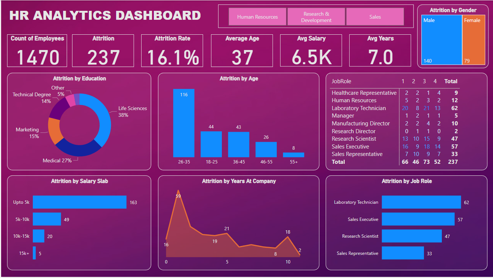

# HRAnalytics-Dashboard

## Objective

Help an Organization to improve employee performance retentation by creating HR Analytics dashboard

## Visualization

## Project Learnings 

-Identified key factors to reduce attrition.

-Improved the hiring process.

-Improved employee Experience.

-Made Workforce More Productive.

-Gained Employee trust.
